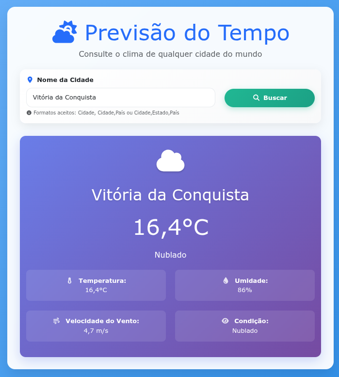

<div align="center">
  
</div>

<p align="center">
  
</p>

<h2 align="center">Aplicação web para consulta do clima por cidade.</h2>

## **Visão Geral**

A **Weather API** é uma aplicação web desenvolvida em ASP.NET Core para consulta de informações climáticas. A aplicação permite buscar dados meteorológicos de qualquer cidade do mundo, exibindo temperatura, condições climáticas, umidade e velocidade do vento.

## **Instruções de Uso**

Para rodar a **Weather API** localmente, siga os passos abaixo:

### **Pré-requisitos**

- .NET SDK 9.0 ou superior
- Chave da API do OpenWeatherMap (gratuita)

### **Configuração do Projeto**

1. Clone este repositório:

   ```bash
   git clone https://github.com/seu-usuario/WeatherAPI.git
   ```

2. Acesse o diretório do projeto:

   ```bash
   cd ./WeatherAPI
   ```

3. Obtenha sua chave da API:

   - Crie uma conta gratuita no [OpenWeatherMap](https://openweathermap.org/api)
   - Acesse a página de chaves da API: [https://home.openweathermap.org/api_keys](https://home.openweathermap.org/api_keys)
   - Copie sua chave de API

4. Configure as variáveis de ambiente criando um arquivo `.env`:

   ```bash
   WeatherApi__ApiKey=SUA_CHAVE_AQUI
   ```

5. Instale as dependências do projeto:

   ```bash
   dotnet restore
   ```

6. Inicie a aplicação em modo de desenvolvimento:

   ```bash
   dotnet watch run
   ```

7. Acesse a aplicação no navegador:
   - **URL:** `http://localhost:5063`

## **Variáveis de Ambiente**

A aplicação utiliza as seguintes variáveis de ambiente para configuração segura:

- `WeatherApi__ApiKey`: Chave da API do OpenWeatherMap para autenticação nas consultas meteorológicas

**Importante:** Você deve criar o arquivo `.env` baseado no template `.env.example` fornecido, pois o arquivo `.env` não é versionado no Git por questões de segurança.

## **Tecnologias Utilizadas**

- **Framework:** ASP.NET Core 9.0
- **Front-end:** Bootstrap 5 + Font Awesome
- **API Externa:** OpenWeatherMap API
- **Segurança:** Variáveis de ambiente com DotNetEnv
- **Controle de Versão:** Git e GitHub

## **Estrutura do Projeto**

```
WeatherAPI/
├── Controllers/
│   └── WeatherController.cs   # Controlador principal da aplicação
├── Models/
│   └── WeatherData.cs         # Modelo de dados climáticos
├── Views/
│   └── Weather/Index.cshtml   # Interface de busca e exibição
├── wwwroot/                   # Arquivos estáticos (CSS, JS, ícones)
├── Program.cs                 # Configuração e inicialização
├── appsettings.json           # Configurações da aplicação
└── .env                       # Variáveis de ambiente (não versionado)
```
